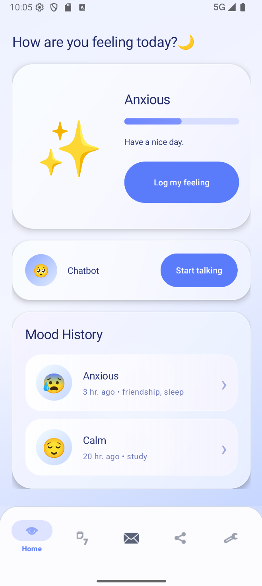
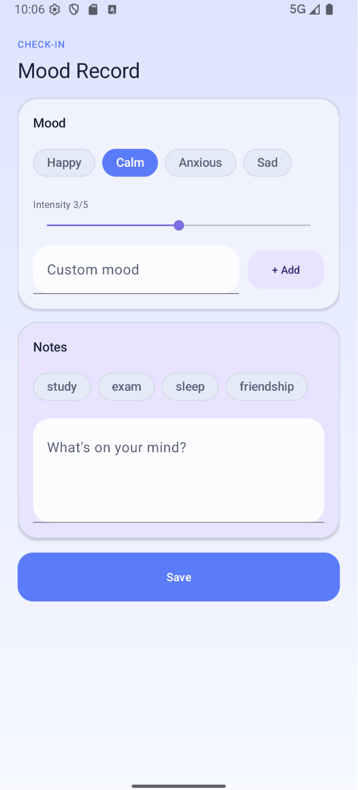
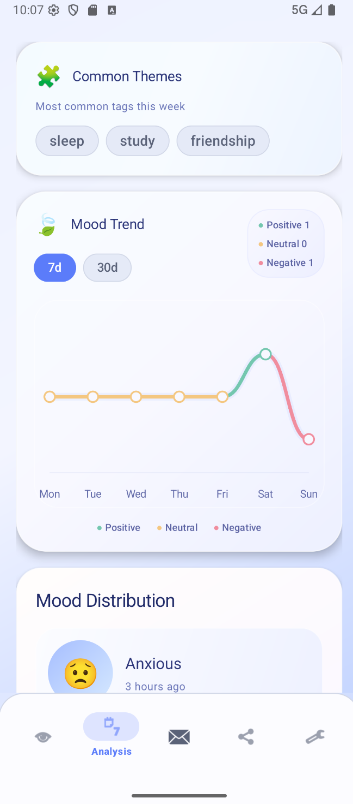
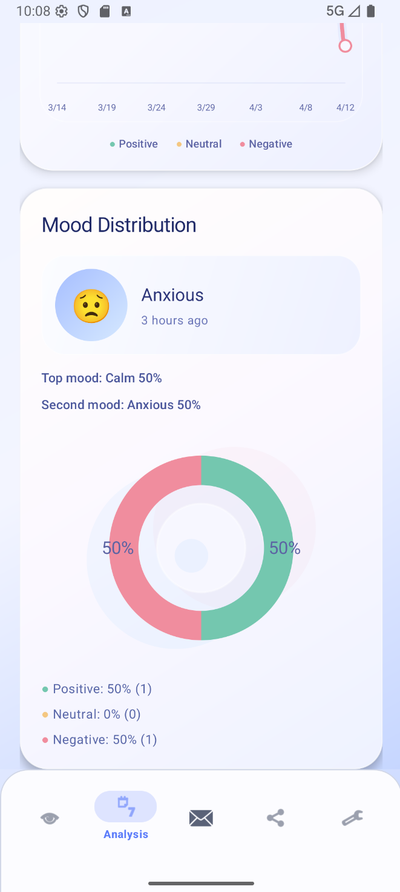
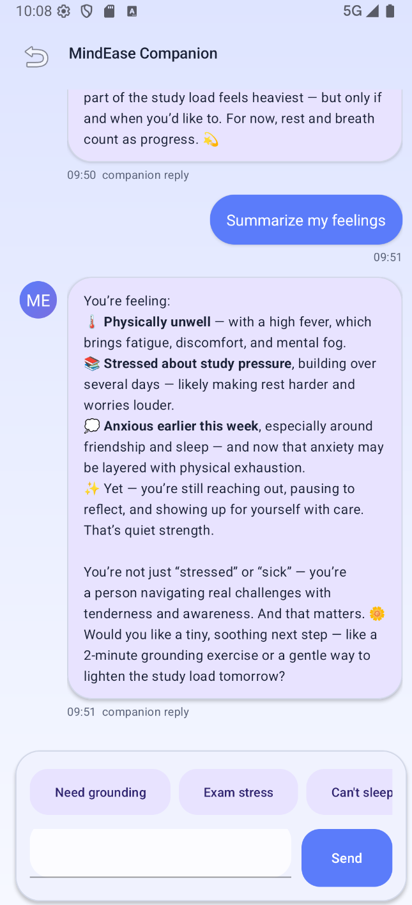
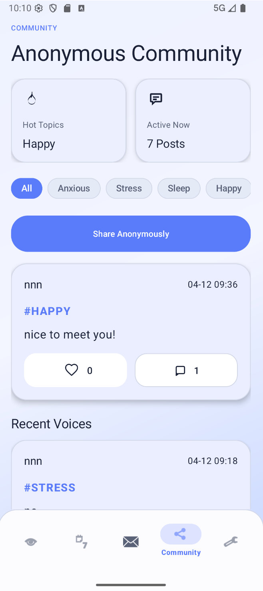
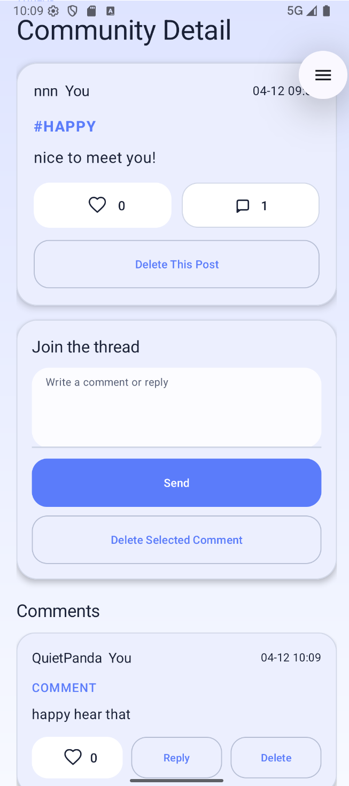
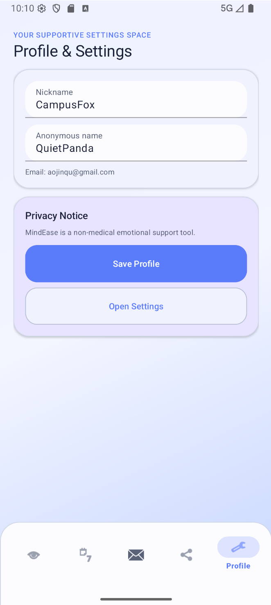

# MindEase

MindEase is an Android app for university students focused on low-pressure emotional check-ins, trend awareness, lightweight support, and anonymous community expression. The current project already delivers a working MVP around the flow `record -> analyze -> suggest -> chat -> share`.

This project is built with Android Studio, Java, XML, Room, Firestore, and an OpenAI-compatible agent integration path. It is a course/project-style product prototype, not a medical product, and it does not replace professional psychological support or diagnosis.

## Overview

MindEase currently includes:

- Onboarding, authentication, and session-based app entry flow
- Daily mood recording with mood type, intensity, diary text, and tags
- Mood record create, edit, delete, and recent-record retrieval
- Weekly and monthly mood analysis with charts
- Calendar-based mood review
- Rule-based personalized suggestions
- Therapy-style Agent chat with prompt context injection and fallback replies
- Anonymous community with post creation, browsing, filtering, likes, comments, replies, and delete-your-own content actions

## Current Features

### 1. Account and app flow

- `SplashActivity` checks onboarding and login state
- `OnboardingActivity` introduces the product direction
- `AuthActivity` supports register/login flow for the MVP
- `MainActivity` hosts the five-tab bottom navigation

### 2. Mood diary

- Create a mood record with:
  - mood type
  - intensity
  - diary text
  - emotion tags
- Edit existing records
- Delete existing records
- Review recent records from the home flow

### 3. Analysis and suggestions

- Weekly and monthly mood trends
- Chart-based summaries using `MPAndroidChart`
- Rule-based sentiment analysis
- AI-summary extension point with graceful fallback
- Personalized suggestions generated from recent mood data

### 4. Calendar review

- Calendar-style overview of recorded mood days
- Tap a date to inspect that day's entries

### 5. Therapy Agent

- Dedicated chat screen
- Prompt context built from recent mood records, trends, and suggestions
- OpenAI-compatible remote API integration path
- Local fallback reply when remote generation fails
- Basic risk guidance support

### 6. Anonymous community

- Create anonymous posts with emotion tags
- Browse community feed
- Filter posts by tag
- Like posts
- Open post details
- Add comments and replies
- Delete your own post
- Delete your own comment when it has no child replies
- Firestore-backed post/comment/like storage
- Anonymous identity mapping plus basic content moderation


## Screenshots

### Splash / Onboarding

Brief note about first-launch experience.

### Mood Editor


Brief note about mood recording flow.

### Analysis


Brief note about weekly/monthly charts.

### Agent Chat

Brief note about contextual emotional support.

### Community Feed

Brief note about anonymous posting and browsing.

### Community Detail

Brief note about comments, replies, and delete-your-own actions.

### Profile / Settings

Brief note about anonymous name and privacy settings.


## Tech Stack

- Language: `Java 11`
- UI: `Android XML` + `Material Components`
- Architecture: `MVVM + Repository + UseCase + Service`
- Local storage: `Room`
- Community backend: `Firebase Firestore`
- Charts: `MPAndroidChart`
- Build: `Gradle Kotlin DSL`
- Min SDK: `24`
- Target SDK: `36`

## Project Structure

```text
MindEase/
|-- app/
|   `-- src/
|       |-- main/java/com/mindease/
|       |   |-- app/        # app bootstrap and dependency container
|       |   |-- common/     # shared session, result, and utility code
|       |   |-- data/       # Room, Firestore, repositories, data sources
|       |   |-- domain/     # models, repository contracts, services, use cases
|       |   `-- feature/    # UI screens, fragments, view models, adapters
|       |-- main/res/       # layouts, drawables, values, menus
|       `-- test/           # unit tests
|-- docs/                   # PRD, technical design, board, and notes
|-- gradle/
`-- README.md
```

## Getting Started

### Requirements

- Android Studio
- JDK 11
- Android SDK installed locally
- Firebase configuration if you want the community module to talk to Firestore

### Open in Android Studio

1. Open the repository root in Android Studio.
2. Wait for Gradle sync to finish.
3. Make sure `local.properties` points to a valid Android SDK.
4. If needed, provide the Firebase config used by this project.
5. Run the `app` module on an emulator or physical device.

### Optional Agent configuration

The Agent chat reads these Gradle properties:

- `mindease.chat.baseUrl`
- `mindease.chat.apiKey`
- `mindease.chat.model`

If they are missing, the build still works, but remote Agent replies may not be available.

### Command line build

```powershell
.\gradlew.bat assembleDebug
```

## Testing

Run unit tests:

```powershell
.\gradlew.bat test
```

Recent validation used during development:

```powershell
.\gradlew.bat assembleDebug
```

## Documentation

- [PRD](docs/PRD.md)
- [Technical Design](docs/TECHNICAL_DESIGN.md)
- [Development Board](docs/BOARD.md)
- [Task Notes](docs/TASK.md)

## Suggested Demo Flow

If you need to demo the app in class or in a project review, this order works well:

1. Launch flow: `Splash -> Onboarding -> Auth`
2. Create a mood record
3. Show analysis and calendar updates
4. Open Agent chat and send one message
5. Enter the anonymous community
6. Create a post, open detail, comment/reply, and show delete-your-own behavior
7. End on profile/settings to show privacy-related controls

## Known Gaps

The current app is already functional, but some areas are still iterative:

- Community reporting and advanced moderation are not finished
- Agent session list/history management is still limited
- Remote agent integration still depends on actual endpoint configuration
- UI automation coverage is still incomplete

## Scope Note

MindEase is a supportive emotional wellness app prototype for coursework and product demonstration. It is not a medical system and should not be presented as clinical diagnosis or treatment software.
